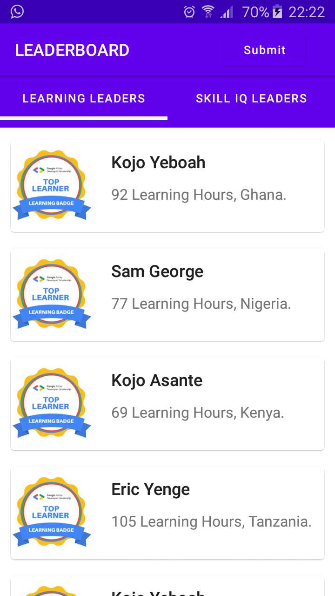
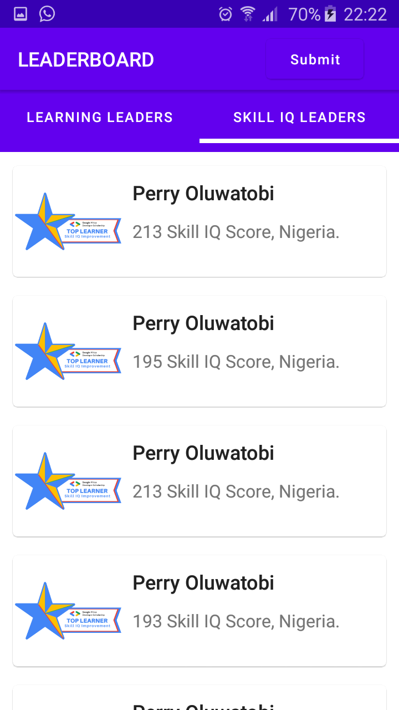
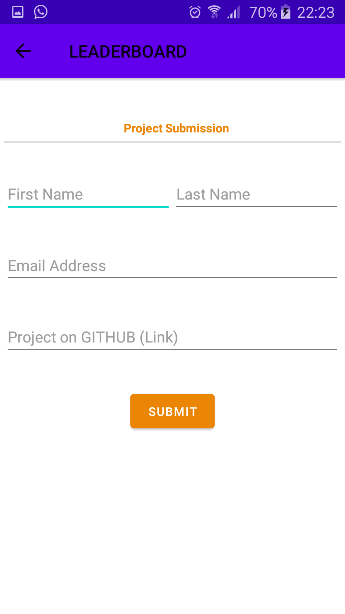
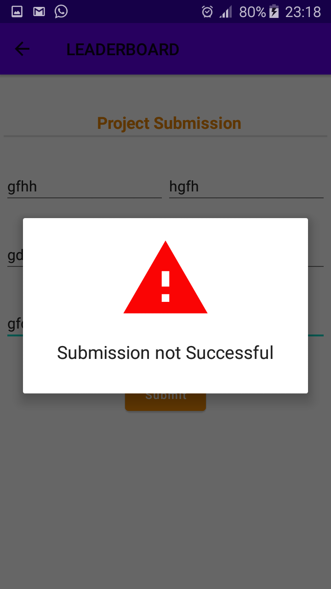
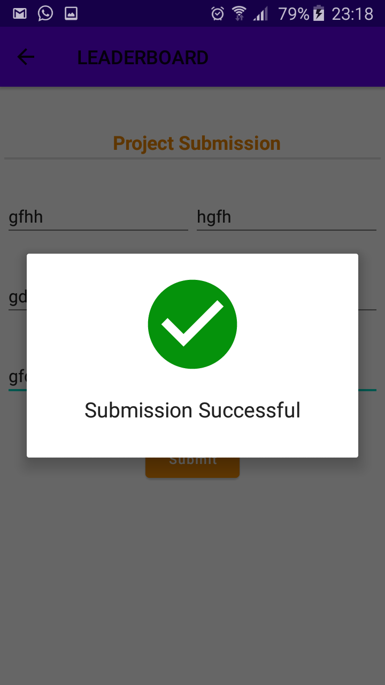

# GADS_Leaderboard
An Android app that connects to a REST-API and lists Top 20 learners from each given category  e.g skill IQ Leaders &amp; Learning Leaders categories.

 Launch Activity : first activity that shows when app is started. 

 Main Activity : contains a TabLayout that fetches and displays Learning leaders & Skill IQ from a REST API. 

 Skill IQ 

 Submit Project Activity 

 Submit Failure : notify user when submit request fails. 

 Submit Success : notify user when submit request is successful. 

